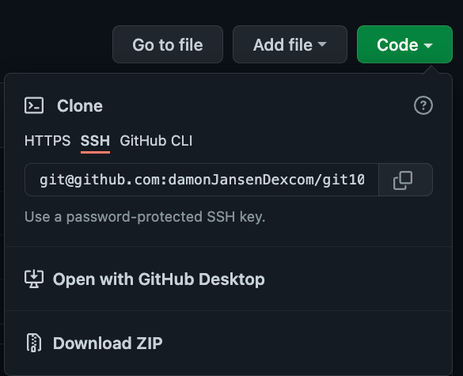
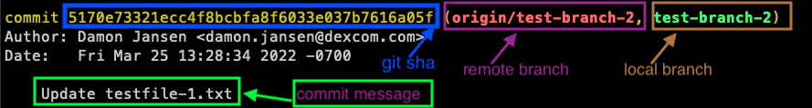
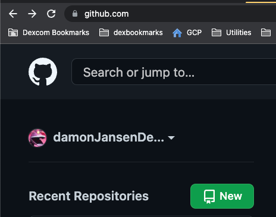

# git101

Option 1: Git 101

<table>
  <tr>
   <td colspan="3" >
<h3>Getting Git On Your Computer</h3>

   </td>
  </tr>
  <tr>
   <td>Mac
   </td>
   <td>git –version

If you get a version, you’re good. If not, do the following:

Install homebrew:

/bin/bash -c "$(curl -fsSL <a href="https://raw.githubusercontent.com/Homebrew/install/HEAD/install.sh">https://raw.githubusercontent.com/Homebrew/install/HEAD/install.sh</a>)"

brew install git
   </td>
   <td>
   </td>
  </tr>
  <tr>
   <td>Windows / Linux
   </td>
   <td>Instructions here: <a href="https://git-scm.com/book/en/v2/Getting-Started-Installing-Git">https://git-scm.com/book/en/v2/Getting-Started-Installing-Git</a>
   </td>
   <td>
   </td>
  </tr>
</table>

<table>
  <tr>
   <td colspan="3" >
<h3>Setting Up Our Shared Repo</h3>

   </td>
  </tr>
  <tr>
   <td colspan="3" >Log in to your github account.

Go to: <a href="https://github.com/damonJansenDexcom/git101.git">https://github.com/damonJansenDexcom/git101.git</a>

In the upper right, click "Fork"

Either:

a. Go to "Code" and copy the link for how you clone repos.

<code>git clone &lt;link you copied></code>

b. If you do not have authentication set up, you can just "Download ZIP". Unzip the file.

<code>cd git101</code>

(You'll be able to work locally, but you can ignore anything referring to push, remote,  upstream)
   </td>
  </tr>
</table>

<table>
  <tr>
   <td colspan="3" >
<h3>First Steps: Branches, Commits, Log</h3>

   </td>
  </tr>
  <tr>
   <td><strong>Motivation: Why would I do this?</strong>
   </td>
   <td><strong>Commands to run in terminal</strong>
   </td>
   <td><strong>Notes</strong>
   </td>
  </tr>
  <tr>
   <td>I would prefer not to use vim as my git editor.
   </td>
   <td>Optional: if you are not familiar with vim, you may want to use a different editor for git.

To use VS Code:

<code>export GIT_EDITOR="code --wait"</code>

(Note that this only affects the shell you run it in. You'll need to add it to your .bashrc / .zshrc / similar to )
   </td>
   <td>There are other options <a href="https://stackoverflow.com/questions/2596805/how-do-i-make-git-use-the-editor-of-my-choice-for-commits">here</a>.
   </td>
  </tr>
  <tr>
   <td>
   </td>
   <td><code>git branch</code>
   </td>
   <td>Locally, there is only one branch – main.
   </td>
  </tr>
  <tr>
   <td>
   </td>
   <td><code>git branch -a</code>
   </td>
   <td>-a: all

You can see the remote and local branches
   </td>
  </tr>
  <tr>
   <td>I want to start at a place where there has been some particular work done already.
   </td>
   <td><code>git checkout test-branch-3</code>
   </td>
   <td>Note the output:

<code>branch 'test-branch-3' set up to track 'origin/test-branch-3'.</code>

<code>Switched to a new branch 'test-branch-3'</code>

"set up to track" -> we have a link between our local branch and the remote branch, and they both have the same name
   </td>
  </tr>
  <tr>
   <td>I want to let others have access to the changes I have made.
   </td>
   <td><code>git checkout -b &lt;your-name>-from-test-branch-3</code>

<code>git push</code>

Copy the instructions given to create a remote (upstream) branch

 <code>git push --set-upstream origin &lt;your-name>-from-test-branch-3</code>
   </td>
   <td>Note the initial error, telling us that the branch only exists locally:

<code>fatal: The current branch damon-jansen-from-test-branch-3 has no upstream branch.</code>
   </td>
  </tr>
  <tr>
   <td>I want to do some editing and I want feedback about which files have changed.
   </td>
   <td>1. in all files, change all instances of "potatoes" to "turnips"

2. <code>git status</code>
   </td>
   <td>Note the instructions git gives, telling you what you can do

<code>Changes not staged for commit:</code>

<code>  (use "git add &lt;file>..." to update what will be committed)</code>

<code>  (use "git restore &lt;file>..." to discard changes in working directory)</code>

<code>	modified:   testfile-3.txt</code>

<code>no changes added to commit (use "git add" and/or "git commit -a")</code>
   </td>
  </tr>
  <tr>
   <td> I think my changes to testfile-3.txt are worth keeping.  The <code>add </code>command tells git that testfile-3.txt should be included in my next commit. If you don’t add it, it won’t be included.  Git does not assume all your changes are golden.
   </td>
   <td><code>git add testfile-3.txt</code>

<code>git status</code>
   </td>
   <td>Continue noting what output git gives you. It often gives you hints for next steps
   </td>
  </tr>
  <tr>
   <td>Adding commits lets me keep track of my progress and changes as I  work. Git considers each <code>commit</code> a “change point” or "save point".

<code>"Change potatoes -> turnips"</code> is a message/label that tells everyone that the commit was about.
   </td>
   <td><code>git commit -m "Change potatoes -> turnips"</code>
   </td>
   <td>
   </td>
  </tr>
  <tr>
   <td>I want to see all the commits on this branch.
   </td>
   <td>git log
   </td>
   <td>Read everything in the top commit

   </td>
  </tr>
  <tr>
   <td>
   </td>
   <td>Follow the same steps, changing "apples" to "sardines", and make a commit, and git push
   </td>
   <td>
   </td>
  </tr>
</table>

<table>
  <tr>
   <td colspan="3" >
<h3>Temporary States</h3>

   </td>
  </tr>
  <tr>
   <td><strong>Motivation: Why would I do this?</strong>
   </td>
   <td><strong>Commands to run in terminal</strong>
   </td>
   <td><strong>Notes</strong>
   </td>
  </tr>
  <tr>
   <td>I want to save the changes I currently have, but not make a commit.
   </td>
   <td>Make some changes to the files.

<code>git status</code>

<code>git stash save "&lt;description of changes>"</code>

<code>git status</code>

<code>git stash list</code>

<code>git stash apply</code>

Make some changes

<code>git stash save "&lt;description of changes>"</code>

<code>git stash list</code>

<code>git stash apply stash@{0}</code>
   </td>
   <td>the stash is a place to put changes so that they are retrievable

git stash apply puts back the changes for the most recent stash (<code>stash@{0}</code>)

<code>git stash apply stash@{&lt;number>}</code> lets you apply a particular stash
   </td>
  </tr>
</table>

<table>
  <tr>
   <td colspan="3" >
<h3>Rewriting History</h3>

   </td>
  </tr>
  <tr>
   <td><strong>Motivation: Why would I do this?</strong>
   </td>
   <td><strong>Commands to run in terminal</strong>
   </td>
   <td><strong>Notes</strong>
   </td>
  </tr>
  <tr>
   <td>I'd like to change the last commit message
   </td>
   <td><code>git commit —amend</code>

Change the text of your commit message

<code>git push</code>

…

<code>git push –force</code>
   </td>
   <td>Read the error message. –amend rewrites history, so local remote cannot be integrated.

<code>git push –force</code>

to rewrite over the remote, choosing the version that is local
   </td>
  </tr>
  <tr>
   <td>I'd like to change the last commit message
   </td>
   <td><code>git rebase -i HEAD~1</code>

Change <code>pick</code> to <code>reword</code> (or just <code>r</code>)

Change the commit message and save
   </td>
   <td>HEAD is the snapshot of the last commit

HEAD~1 is one commit before that
   </td>
  </tr>
  <tr>
   <td>I'd like to turn two commits into one (or similar)
   </td>
   <td><code>git log </code>

Note the first two commits

<code>git rebase -i HEAD~2</code>

Keep <code>pick</code> on the first commit

Change <code>pick</code> to <code>squash</code> (or just <code>s</code>) on the second commit

…

<code>git log</code>
   </td>
   <td>The instructions are helpful. You'll want only one line without a '<code>#</code>", and that will be the new commit message of the combined commits.

Note in the git log that there is only one commit where there used to be two.
   </td>
  </tr>
  <tr>
   <td>I'd like to rewrite the history in a number of ways.
   </td>
   <td><code>git rebase -i</code>
   </td>
   <td>There are many options with interactive rebase. You might like to try some more out.
   </td>
  </tr>
</table>

<table>
  <tr>
   <td colspan="3" >
<h3>Time Traveling</h3>

   </td>
  </tr>
  <tr>
   <td><strong>Motivation: Why would I do this?</strong>
   </td>
   <td><strong>Commands to run in terminal</strong>
   </td>
   <td><strong>Notes</strong>
   </td>
  </tr>
  <tr>
   <td>I'd like to go to a particular time/place in the code (with a git hash)
   </td>
   <td><code>git checkout c4d6c8c9091ccdee4734c3b156c5e9da01af203b</code>

<code>git status</code>

Often, a next step:

<code>git checkout -b &lt;your-name>-branching-from-a-git-hash</code>
   </td>
   <td>This is the HEAD detached state. I like to think of it as "not on a branch." It's great for starting from a known state.

Often, a next step is to checkout a new branch.
   </td>
  </tr>
  <tr>
   <td>I'd like to mark a particular place in the code with a recognizable name, and let others know about it.
   </td>
   <td><code>git tag &lt;a-great-name-for-a-tag></code>

<code>git push origin &lt;a-great-name-for-a-tag></code>
   </td>
   <td>
   </td>
  </tr>
  <tr>
   <td>I'd like to go to a particular time/place in the code (with a tag)
   </td>
   <td><code>git checkout dj-here-is-a-great-tag</code>

<code>git log</code>
   </td>
   <td>Note that the tag is called out in the most recent commit
   </td>
  </tr>
</table>

<table>
  <tr>
   <td colspan="3" >
<h3>Getting Others' Changes </h3>

   </td>
  </tr>
  <tr>
   <td><strong>Motivation: Why would I do this?</strong>
   </td>
   <td><strong>Commands to run in terminal</strong>
   </td>
   <td><strong>Notes</strong>
   </td>
  </tr>
  <tr>
   <td>I want to get changes from another branch onto my branch. (Example 1: Using rebase)
   </td>
   <td>Set ourselves up:

<code>git checkout dj-here-is-a-great-tag</code>

<code>git log</code>

Note that the most recent commit (the one at the top) has the "dj-here-is-a-great-tag" tag

<code>git checkout -b &lt;your-name>-branch-to-rebase</code>

Now, make any old commit.

<code>git log</code>

Notice that (reading top to bottom), it now has your commit, then the tagged one.

Now, we want to get some recent changes from `main` branch.

<code>git fetch origin</code>

<code>git rebase origin/main</code>

<code>git log</code>

Notice that your commit is still at the top, but there are commits in between it and the tagged commit. The history has changed.
   </td>
   <td>The rebase put your commit "on top of" what is on main.

This kind of rebase can be hard if there are a lot of conflicts between what you've done and what's on the other branch.

See the next example for a solution
   </td>
  </tr>
  <tr>
   <td>I want to get changes from another branch onto my branch. (Example 2: Using merge)
   </td>
   <td>Set up just like Example 1

<code>git checkout dj-here-is-a-great-tag</code>

<code>git checkout -b &lt;your-name>-branch-to-merge</code>

Now, make any old commit.

<code>git fetch origin</code>

<code>git merge origin/main</code>

Complete the commit message like an commit.

<code>git log</code>

Note that the history has not changed. There is just a new "merge commit" that represents the bringing of that new material in.
   </td>
   <td>Some folks really like to use rebase, some like to use merge. This is a good one to learn how to do both and talk with your co-workers about it.
   </td>
  </tr>
</table>

<table>
  <tr>
   <td colspan="3" >
<h3>Sandboxes: Experimenting On My Own</h3>

   </td>
  </tr>
  <tr>
   <td><strong>Motivation: Why would I do this?</strong>
   </td>
   <td><strong>Commands to run in terminal</strong>
   </td>
   <td><strong>Notes</strong>
   </td>
  </tr>
  <tr>
   <td>I want to try out git commands in a safe place.
   </td>
   <td><code>mkdr &lt;name-of-sandbox></code>

<code>cd &lt;name-of-sandbox></code>

<code>git init</code>
   </td>
   <td>This is all it takes to have a local git repo.
   </td>
  </tr>
  <tr>
   <td>I want to try out git commands, including pushing/pulling to a remote.
   </td>
   <td>Go to <a href="https://github.com/">https://github.com/</a> and login to your account.
You can make a new repo:

   </td>
   <td>
   </td>
  </tr>
</table>

Option 2: [https://learngitbranching.js.org/](https://learngitbranching.js.org/)
